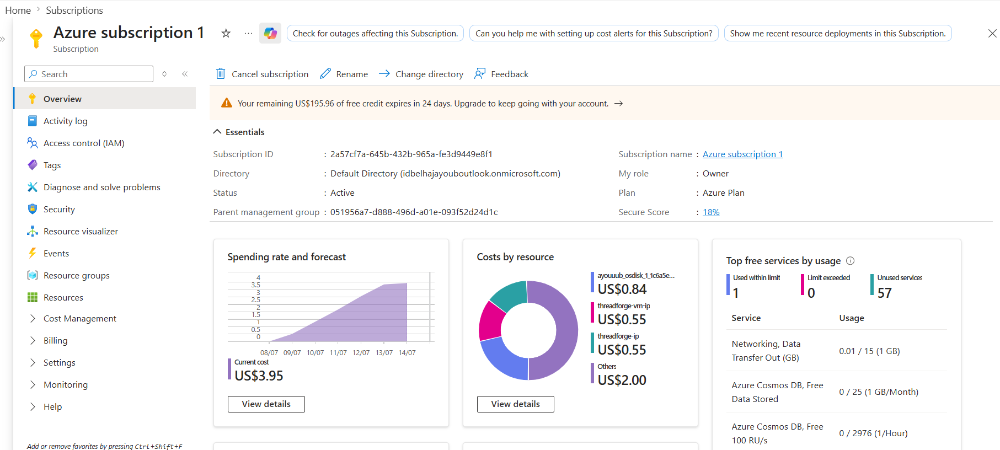

## Labs Azure

### Azure Portal — Subscription Overview
Shows the `sprint-devops-simplon` subscription in the Azure Portal Subscriptions page.

### Credit Balance
Credit remaining visible in Cost Management, confirming the free trial credit amount.

### Subscription ID and Tenant ID
Both IDs displayed with middle portions masked for security (e.g. `2a57cf7a-****-****-****-fe3d9449e8f1`).

### Budget and Alert Thresholds
Budget configuration showing two alert conditions at 80% and 100% usage.

### Free Trial Credit Banner
The subscription Overview page showing the Free Trial / credit status message.

### Microsoft Entra ID — Users
User list in Microsoft Entra ID showing the `devops-<prénom>` account.

### Access Control (IAM) — Owner Role
Role assignments tab on the subscription showing `devops-<prénom>` with the Owner role.

### Portal Connected as Devops User
Azure Portal session authenticated as `devops-<prénom>`, confirmed via the avatar dropdown.

